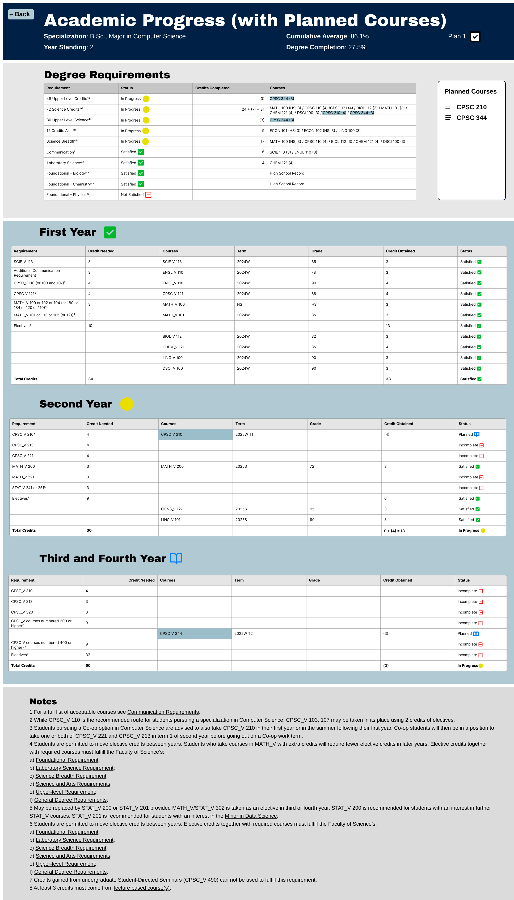

# UBC Degree Planner

A web application that helps UBC students build, validate, and visualize multi-year degree plans. Students can test "what-if" scenarios, track prerequisite requirements in real time, and see a clear map of their academic progress toward graduation.

## Features

### Dynamic Plan Validation & "What-If" Scenario Testing
- Build a multi-year course plan organized by term (Winter, Spring, Summer)
- Drag-and-drop courses between terms to test different arrangements
- Instant validation against prerequisite rules, credit limits, and degree requirements
- Real-time error highlighting (e.g., "You cannot take CPSC 344 without CPSC 210 or CPEN 221")
- Create and compare multiple simulated plans side-by-side

### Academic Progress & Requirement Mapping
- Upload completed courses to establish your transcript
- Visual credit progress bar (completed vs. planned vs. total required)
- Academic goals tracking with met/not-met status indicators
- Degree requirement checklist broken down by year standing
- Estimated graduation timeline based on your current plan

### Course Search & Discovery
- Search courses by code, name, or department
- Filter by department and level
- View course details including credits, description, and prerequisites
- Quick-add courses directly from search results into your plan

## Prototype

| Plan Builder | Course Search | Validation | Progress View |
|:---:|:---:|:---:|:---:|
|  |  |  |  |

> Full design on [Figma](https://www.figma.com/design/c7CLJiZvlwFrpx4Og1MQz9/UBC-Degree-PLanner?node-id=152-988&t=UbGVylrJVHtihFET-0)

## Tech Stack

| Layer | Technology |
|-------|------------|
| Frontend | TypeScript, React, Tailwind CSS |
| Backend | TypeScript, Express |

## Repository Structure

```
UBC-Degree-Planner/
├── backend/                # Express API server
│   ├── src/
│   │   ├── routes/         # API route handlers
│   │   ├── services/       # Business logic (validation, planning)
│   │   ├── models/         # Data models & types
│   │   └── index.ts        # Server entry point
│   ├── package.json
│   └── tsconfig.json
├── frontend/               # React SPA
│   ├── src/
│   │   ├── components/     # Reusable UI components
│   │   ├── pages/          # Page-level components
│   │   ├── hooks/          # Custom React hooks
│   │   ├── types/          # Shared TypeScript types
│   │   ├── services/       # API client functions
│   │   ├── App.tsx
│   │   └── main.tsx
│   ├── package.json
│   ├── tailwind.config.js
│   └── tsconfig.json
├── reference/              # Figma prototype screenshots
├── README.md
└── LICENSE
```

## Getting Started

### Prerequisites

- [Node.js](https://nodejs.org/) (v18 or higher)
- npm or yarn

### Installation

```bash
git clone https://github.com/DavidHua04/UBC-Courses-Visualization.git
cd UBC-Courses-Visualization
```

**Backend:**
```bash
cd backend
npm install
npm run dev
```

**Frontend:**
```bash
cd frontend
npm install
npm run dev
```

The frontend will be available at `http://localhost:5173` and the backend API at `http://localhost:3000`.

## Contributing

Contributions are welcome! To contribute:

1. Fork the repository
2. Create a feature branch: `git checkout -b feature/your-feature-name`
3. Commit your changes: `git commit -m "Add your message here"`
4. Push the branch: `git push origin feature/your-feature-name`
5. Open a Pull Request

## License

This project is licensed under the MIT License - see the [LICENSE](LICENSE) file for details.
