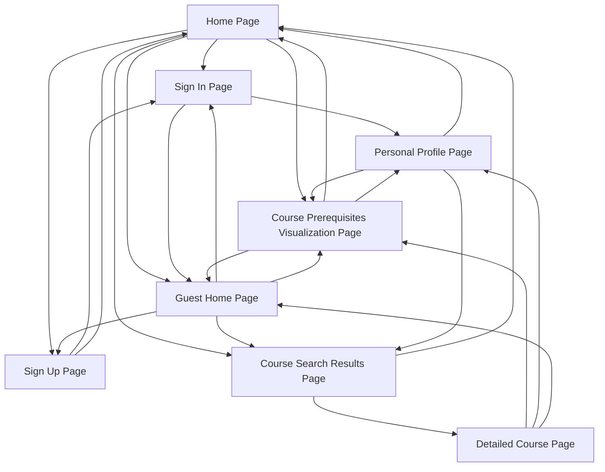

# Website Design Breakdown

## **1. Home Page**
### Purpose:
- Introduce the website and provide access to main functionalities.

### Functions:
1. **Search Course Prerequisites**:
   - Input field for course code.
   - Button to "Visualize Prerequisites."
   - Output: Mermaid.js-generated graph showing prerequisites.
   - Interaction:
     - Autocomplete suggestions while typing.
     - Displays the graph inline without refreshing the page.

2. **Search Courses**:
   - Input field for keywords.
   - Button to "Search Courses."
   - Output: List of courses matching the keyword with name, description, and links to detailed course pages.

3. **Sign In / Sign Up / Use as Guest**:
   - **Sign In**: Access personalized features.
   - **Sign Up**: Create a new account.
   - **Use as Guest**: Temporary access to all functions that do not require personal information.
     - Interaction: Clicking "Use as Guest" redirects to a guest-friendly version of the site with access to Course Search and Prerequisite Visualization.

### Links:
- Sign In Page
- Sign Up Page
- Guest Home Page (when using as a guest)

---

## **2. Guest Home Page**
### Purpose:
- Allow users to explore features without creating an account.

### Functions:
1. **Search Course Prerequisites**:
   - Identical functionality to the regular home page.

2. **Search Courses**:
   - Identical functionality to the regular home page.

3. **Upgrade to Full Access**:
   - Prompt: "Sign In or Sign Up to save progress and access personalized features."
   - Button linking to the Sign In and Sign Up pages.

### Links:
- Sign In Page
- Sign Up Page
- Course Prerequisites Visualization Page
- Course Search Results Page

---

## **3. Sign Up Page**
### Purpose:
- Allow new users to create an account.

### Functions:
1. **Form Fields**:
   - Username (text input).
   - Password (keyword, masked input).
   - Confirm Password (validation against password).

2. **Submit Button**:
   - Creates account and redirects to the Sign In page.
   - Interaction: Displays error messages for invalid entries (e.g., username already exists, password mismatch).

### Links:
- Sign In Page
- Home Page (via logo or header)

---

## **4. Sign In Page**
### Purpose:
- Authenticate existing users and grant access to personal features.

### Functions:
1. **Form Fields**:
   - Username (text input).
   - Password (masked input).

2. **Submit Button**:
   - Logs in user and redirects to the Personal Profile page.
   - Interaction: Error message for invalid credentials.

3. **Option to Use as Guest**:
   - Button to "Continue as Guest" linking to the Guest Home Page.

### Links:
- Home Page
- Personal Profile Page (after successful login)
- Guest Home Page

---

## **5. Personal Profile Page** *(Requires Sign In)*
### Purpose:
- Provide a personalized space to manage academic planning.

### Functions:
1. **User Information Section**:
   - Display username, major, and GPA.
   - Editable fields for major and GPA calculation settings (e.g., 4.0 scale or percentage).

2. **Course History**:
   - List of completed courses with grades.
   - Option to add/edit course history.

3. **Wishlist Section**:
   - Add/edit courses the user wants to take.

4. **Course Arrangement Generator**:
   - Input fields for maximum credits per term.
   - Filters to exclude specific courses or terms.
   - Button to generate a term-wise schedule.
   - Output: Dynamic table or calendar with recommended schedule.

5. **Navigation Links**:
   - Accessible menu to quickly navigate to key features.

### Links:
- Home Page
- Course Prerequisites Visualization Page
- Course Search Results Page

---

## **6. Course Prerequisites Visualization Page**
### Purpose:
- Provide an interactive graph of prerequisites for a specific course.

### Functions:
1. **Search Input**:
   - Input field for course code.
   - Autocomplete for valid course codes.

2. **Visualization Output**:
   - Displays a dynamic Mermaid.js graph.

3. **Interaction Options**:
   - Button to reset/clear the search field.
   - Zoom and pan functionality for large graphs.

### Links:
- Home Page
- Personal Profile Page
- Guest Home Page

---

## **7. Course Search Results Page**
### Purpose:
- Display a list of courses matching the user’s keyword search.

### Functions:
1. **Search Input**:
   - Input field for refining the search.

2. **Search Results**:
   - List of courses with:
     - Name
     - Description
     - Credits
     - Button to "View Details."

3. **Interaction**:
   - Clicking "View Details" navigates to a detailed course page.

### Links:
- Home Page
- Detailed Course Pages

---

## **8. Detailed Course Page**
### Purpose:
- Provide detailed information about a specific course.

### Functions:
1. **Course Information**:
   - Name, description, credits, and prerequisites.
   - Option to add/remove from wishlist.

2. **Link to Prerequisites Visualization**:
   - Button to view the prerequisite graph for this course.

### Links:
- Course Prerequisites Visualization Page
- Personal Profile Page
- Guest Home Page

---

## **Navigation Map**
1. **Home Page**:
   - Links: Sign In, Sign Up, Guest Home Page, Personal Profile (if signed in), Course Prerequisites Visualization Page, Course Search Results Page.

2. **Guest Home Page**:
   - Links: Sign In, Sign Up, Course Prerequisites Visualization Page, Course Search Results Page.

3. **Sign In/Sign Up Pages**:
   - Links: Home Page, Guest Home Page, Personal Profile Page (after successful login).

4. **Personal Profile Page**:
   - Links: Home Page, Course Prerequisites Visualization Page, Course Search Results Page.

5. **Course Prerequisites Visualization Page**:
   - Links: Home Page, Personal Profile Page, Guest Home Page.

6. **Course Search Results Page**:
   - Links: Home Page, Detailed Course Pages.

7. **Detailed Course Page**:
   - Links: Course Prerequisites Visualization Page, Personal Profile Page, Guest Home Page.

---

